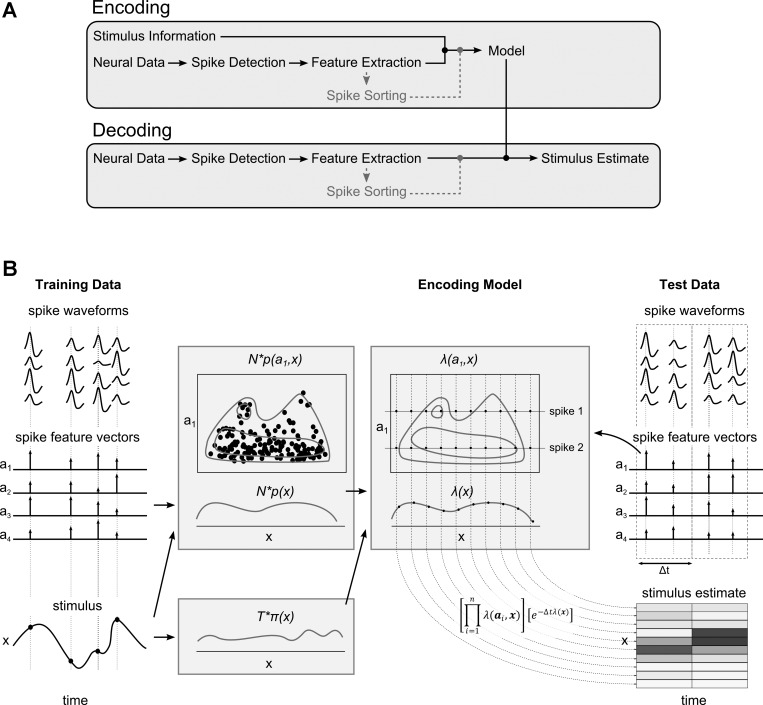

# LFP online

This software package serves dual purpose:

## 1. **Brain-machine interface for realtime decoding of spike trains.**

Main purpose of the software is to decode neural population activity in real-time from LFP(local field potential) signal using either population vector decoder or a cluster-less spike wave shape based method first described in [(Kloosterman et al., 2013)](https://www.ncbi.nlm.nih.gov/pmc/articles/PMC3921373/). Sequence decoding is possible using HMM in combination with the deocding methods. A closed-loop feedback can be provided through the LPT port. This software was used to build the first ever brain-machine interface for real-time decoding of hippocampal reactivation [(Gridchyn et al., 2020)](https://www.sciencedirect.com/science/article/pii/S0896627320300477?via%3Dihub).

This figure from [(Kloosterman et al., 2013)](https://www.ncbi.nlm.nih.gov/pmc/articles/PMC3921373/) summarizes the brain-machine interface architecture and decoding method on which this software package is based:



## 2. **Analysis of tetrode recordings data**

This sofware also provides tools for analysis of neurophysiological data through detection, feature extraction and sorting of spikes from LFP signal. Cell waveshapes, spike features, spike auto- and cross- correlogram functions, power spectrum of the LFP can be calculated and visualized. In addition, if the tracking information is available, spike locations, rate maps and occupancy maps can be analyzed.


**Architecture summary**

Processing is separated in different purpose-specific 'processors'.
Data flows downstream from source to sink processor.
All processors share single preallocated buffer, e.g. processor takes it's inputs from the shared buffer and writes results back to the buffer.
Together processors form a processing pipeline.
The pipeline is configured through a simple configuration file.

## Installation

Install all dependencies listed in [lfp_online/deps-fedora](lfp_online/deps-fedora).
For CentOS 8, SDL2_ttf and ann libraries have to be compiled from source.

```
cd sdl_example/Debug
make lfp_online
```

## Running

```
cd sdl_example/Debug
./lfp_online path_to_config_file
```

## Configuration
Config files are text files that contain:

    1. parameter definitions in form 'variable_name=variable_value'
    2. sub-config references: '#include' followed by path to sub-config in next line
    3. pipeline composition: keyword 'pipeline' followed by number of processors in the next line, followed by list of processors, one per line
    4. lists: list name followed by line with number of elements in the list and all elements, separated by space
    5. references to previously defined parameters: ${parameter_name}
    
Commenting: all lines, starting with *//* are ignored.

Some parameters have default values specified in the descriptions below. If no default value exists, lfp_online will report error and exit.

Parameters can be overriden in the commandline by providing additional arguments in the form *variable_name=variable_value* after the config path.

## Lists
Part configuration is represented as list of values. When a name of configuration list is specified in a config file, it's values must be provided in the next line, preceded by the count of those values, for example, list pf.groups with 6 values is specified as:

    pf.groups
    6 0 1 0 2 0 3

Unless specified otherwise, list indexing is 0-based, i.e. 0 refers to first element in the groups list.
Two configuration lists are shared across processors and are specified below:

    synchrony - list of tetrode numbers, used for synchrony detection (normally, tetrode with good yield and ideally no interneurons
    tetrode.nums - list of tetrode numbers in case not all tetrodes from the dump are loaded into pipeline; must correspond to number of tetrodes in tetrode config

## Common configuration parameters
Most configuration parameters are specific to a single processor, but these two affect functionality of the whole pipeline:

    out.path.base - this is working directory where spike files and other files are written to and read from
    tetr.conf.path - path to the tetrode configuration file
    
## 64/128 channels configuration
Two parameters are different for 64 and 128 channel configuration.
For 64 channels:

    channel.num=64
    pack.extr.128mode=0
    
For 128 channels:

    channel.num=128
    pack.extr.128mode=1
    
## Processors - definitions and configuration
This is a (still) non-exhaustive list of available processors.

### BinFileReaderProcessor
Read binary recording files in AXONA format and stream LFP signal data and tracking to the internal buffer.
Configuration params:

    1. bin.path - path to binary file in AXONA format
    2. bin.path.[N] - path to N-th binary file, N>=2
    3. chunk.size - size of full single AXONA package, currently 432 and should not be changed unless the format changes
    4. bin.nblock - number of packages read at a time; default = 1
    5. bin.format - format of the binary file: "axona" for files recorded with AXONA recording system, or "matrix" for binary unsigned short matrix of size NSAMPLES X NCHANNELS

### AutocorrelogramProcessor
Calculate and display auto/cross-correlograms of putative units.
Configuration params:

    1. ac.bin.size.ms - time interval of a single bin measured in data samples (e.g. 48 for 2ms interval @24kHz sampling)
    2. ac.n.bins - number of bins in every auto/cross-correlogramm
    3. ac.window.width - starting window width
    4. ac.window.height - starting window height
    5. ac.wait.clust - binary variable, don't process until spikes get cluster identity; default = 0

### CluReaderClusteringProcessor
Read clu/res files and assign cluster identity to spikes in the buffer (based on timestamp match).
No parameters, only uses shared list parameter 'spike.files'

### IntanInputProcessor
Source processor for data acquisition using Intan RHD2000 board.
Reads data from all available channels and puts it to the shared buffer.

Configuration params:

    1. intan.empty_fifo_step - empty board FIFO buffer every 'n' steps, default 5

### PositionTrackingProcessor
Animal position tracking using a FireWire camera.
Works with up to two LEDs (useful for determining head direction).

Configuration params:

    1. pos_track.im_width - image width (in pixels), default 1280
    2. pos_track.im_height - image height (in pixels), default 720
    3. pos_track.im_pos_left - horizontal image offset (in pixels), default 0
    4. pos_track.im_pos_top - vertical image offset (in pixels), default 0
    5. pos_track.rgb_mode - whether or not to use RGB mode for tracking (1 or 0), default 0
    6. pos_track.bin_thr_1 - detection threshold for first LED $\in [0,255]$, default 50
    7. pos_track.bin_thr_2 - detection threshold for second LED $\in [0,255]$, default 50
    8. pos_track.first_led_channel - colour channel for first LED ('red', 'green' or 'blue'), default 'red'
    9. pos_track.second_led_channel - colour channel for second LED ('red', 'green' or 'blue'), default 'blue'

Tracker can work in two modes:

    1. RGB - LEDs are distinguished based on colour and
    2. Brightness - LEDs are distinguished based on light intensity

In RGB mode (pos_track.rgb_mode = 1) parameters pos_track.bin_thr_1 and pos_track.bin_thr_2 are detection thresholds for each LED, while pos_track.first_led_channel and pos_track.second_led_channel specify colour for each LED (red, green or blue).
In brightness mode (pos_track.rgb_mode = 0) only pos_track.bin_thr_1 parameter is relevant because the algorithm uses only one threshold and distinguishes LEDs based on the light intensity.

### PositionWriterProcessor
Writing tracked animal positions to a .csv file.
This processor buffers data and writes to the file in a specified time interval.

Configuration params:

    1. pos_writer.out_file - output file path
    2. pos_writer.writing_interval - write to the file every 'n' seconds, default 10

First raw in the output file is header, followed by a raw with data for each recorded frame.
Each raw contains following fields: 

    * timestamp
    * first LED x coordinate
    * first LED y coordinate
    * second LED x coordinate
    * second LED y coordinate

### RawDataWriterProcessor
Writing raw electrophysiological data to a binary file.
Outputs are two binary files, one with electrophysiological data and one with timestamps for each sample in the first file.
This processor buffers data and writes to the files in a specified time interval.

Configuration params:

    1. raw_data_writer.data_file - electrophysiological data file path
    2. raw_data_writer.timestamps_file - timestamps file path
    3. raw_data_writer.writing_interval - write to the file every 'n' milliseconds, default 100

For each channel datum is represented as a 2-byte integer (microvolts).
For each sample all channels are written together. 
E.g. in a case of 128 channels first group of 256 bytes represent data from first sample, second group of 256 bytes represent data from second sample etc.
Timestamps are 4-byte integers and are associated to each sample in the data file.

### Examples of pipelines for different purposes ###
#### Spike dump - detect and alignt spikes, extract PCA features, interpolate wave shapes ####
* BinFileReader
* PackageExtractor
* SpikeDetector
* SpikeAlignment
* WaveshapeReconstruction
* PCAExtraction
* FetFileWriter

#### Spike display - show features, wave shapes, auto/cross-correlograms, rate maps ####
* FetFileReader
* SDLPCADisplay
* CluReaderClustering
* Autocorrelogram
* SpeedEstimation
* SDLWaveshapeDisplay
* PlaceField
* SDLControlInputMeta

#### Build encoding model based on joint distribution of waveshapes and spatial features / decode using a model ####
* FetFileReader
* KDClustering
* SpeedEstimation

#### Real-time decoding with closed loop trigger - experimental BMI setup ####
* PackageExtractor
* SpikeDetector
* SpikeAlignment
* WaveshapeReconstruction
* PCAExtraction
* KDClustering
* LPTTrigger

